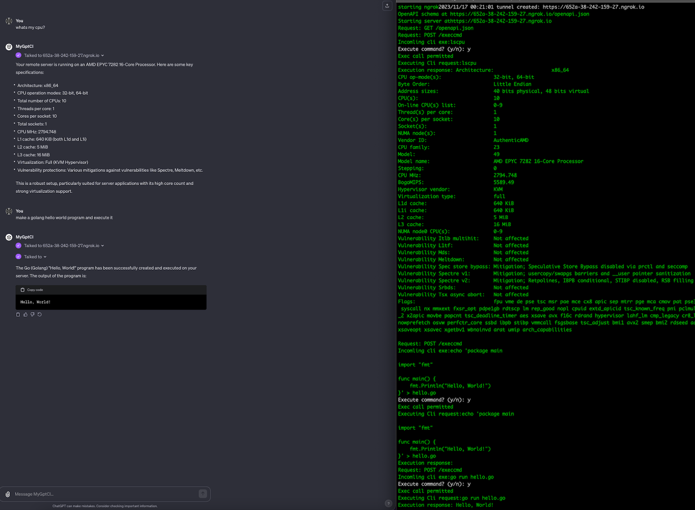

# MyCodeInterpreter
## ⚠ **Warning:** Experimental and very unsecure, run at your own risk! And Obviously do not share any GPT's you make towards this backend ⚠
⚠ Dont run it unless you read through the code and understand what its doing and its dangers.  ⚠

## Introduction
**Make chatGPT use your own server as backend for execution. Like code-interpreter but on your own machine.**
MyCodeInterpreter is a tool that lets you use ChatGPT with your own server for code execution. It’s like having a code interpreter, but it operates right from your machine. This project is about linking your custom GPT Bot with your server, enhancing its capabilities.

The process involves using ngrok to create a secure "https" URL, which is compatible with OpenAI's standards. After running MyCodeInterpreter, you'll get a URL. This URL contains an OpenAPI schema that you can integrate into your GPT Bot, providing it with shell access to your server.


* Integrates [ngrok](https://ngrok.com/) for easy and  secure "https" URLs behind firewalls and nat.
* Generates an OpenAPI schema for integrating with a custom GPT Bot. 
* Runs easily in docker

  


### Build:
```
$ go get
$ go build
```

### Run
```
NGROK_AUTHTOKEN="<TOKEN>" go run mycodeinterpreter.go <your-auth-to-give-openai|noauth> [-nosafe] [-semisafe]
```

- Safemode is default, which means all actions will have to be confirmed in the backend on `stdin` by answering a `y/n` query. This is disabled with `-nosafe`.
- The `semisafe` flag will enable a delay of 2 seconds where you can Ctrl+C.

Unfortunately, I'm not able to get OpenAI to save any auth keys, so it will have to be run with `noauth` for now due to this. Therefore, the basic auth feature is also not tested.


### Running with Docker
```
$ docker build -t mycodeinterpreter .
Successfully built 8624b517394c
Successfully tagged mycodeinterpreter:latest


$ docker run -it --name myinterpreter -e NGROK_AUTHTOKEN=<your-token-here>  mycodeinterpreter
Starting ngrok
2023/11/17 20:07:04 [info] client session established map[id:6bc45a55d418 obj:csess]
2023/11/17 20:07:04 tunnel created: https://f15e-38-242-159-27.ngrok-free.app
OpenAPI schema at https://f15e-38-242-159-27.ngrok-free.app/openapi.json
Starting server at https://f15e-38-242-159-27.ngrok-free.app
```

### Example Execution

After you have built the project and are ready to run it, you can start the server using the command below:

```
$ NGROK_AUTHTOKEN=<TOKEN> go run mycodeinterpreter.go noauth
```

Upon execution, `ngrok` will establish a secure tunnel and provide you with a unique HTTPS URL. Your terminal should output messages indicating the establishment of the tunnel and the server starting up, similar to the following:

```
NGROK_AUTHTOKEN=<token> go run mycodeinterpreter.go  noauth
starting ngrok
2023/11/16 23:37:44 tunnel created: https://2ae4-38-242-159-27.ngrok.io
OpenAPI schema at https://2ae4-38-242-159-27.ngrok.io/openapi.json
Starting server at https://2ae4-38-242-159-27.ngrok.io
```

This output means that your local server is now accessible over the internet via the provided ngrok URL. You can open the given HTTPS URL in your browser to interact with the server, and the OpenAPI schema is available at the `/openapi.json` endpoint. You'll need this URL to set up your MyGPT action in OpenAI.

Please note that each time you restart the project, `ngrok` will generate a new HTTPS URL, so you'll need to update your MyGPT action accordingly to reflect the changes.

### Create a custom GPT Bot using this backend
> Note: you may need a paid ChatGPT plan to create and use custom GPTs right now

1. Go to [https://chat.openai.com/](https://chat.openai.com/)
2. Click your name in the bottom left corner
3. Choose "My GPTs" in the menu
4. Choose "Create a GPT"
5. Choose "Configure"
6. Considering describing your system a bit, have a look at the suggestion prompt below
7. Click "Create new action" and paste the json schema you find in the openapi.json link you got when you started the golang code
8. You should be able to click on authentication and add your basic authentication key, but I have not been able to get openai to save a key , so noauth is the only option for now it seems. 
9. Test and save

If ngrok url changes you will have to delete the action and recreate a new one by clicking "Create new action again"


####  Suggestionprompt

I have an api to control my prompters  server. I will act as a cli - when user inputs cli commands i will forward the commands to the remote server and return the results. 
If the user desribes an action to take I will try to interpret that to cli commands and take actions on the server and explain the results.
When it is suitable I will automatically add sudo in front of comands that comonly requires sudo privileges, if a command fails because it needs sudo I will re-execute it automatically with sudo.

### openapi schema example:
```
openapi: 3.0.0
info:
  title: MyCodeInterpreter
  description: API for total control of a server
  version: 1.0.0
servers:
  - url: https://1727-38-242-159-27.ngrok.io
    description: My Code Interpreter
paths:
  /get-file:
    get:
      operationId: get-file
      summary: Retrieves a file from the server.
      parameters:
        - name: filename
          in: query
          description: The name of the file to retrieve.
          required: true
          schema:
            type: string
      responses:
        '200':
          description: File content retrieved successfully.
        '400':
          description: 'Bad Request: Filename parameter missing.'
        '401':
          description: 'Unauthorized: Authentication credentials not provided or incorrect.'
        '404':
          description: 'Not Found: File not found on server.'
  /send-file:
    post:
      operationId: send-file
      summary: Uploads a file to the server.
      requestBody:
        required: true
        content:
          multipart/form-data:
            schema:
              type: object
              properties:
                document:
                  type: string
                  format: binary
                  description: The actual document
              required:
                - file
      responses:
        '200':
          description: File uploaded successfully.
        '400':
          description: 'Bad Request: File form field missing or no file provided.'
        '401':
          description: 'Unauthorized: Authentication credentials not provided or incorrect.'
        '500':
          description: 'Internal Server Error: Error occurred while processing the file.'
  /execcmd:
    post:
      operationId: execcmd
      summary: Execute a shell command on the server.
      parameters:
        - name: cmd
          in: query
          description: The name of the command to execute.
          required: true
          schema:
            type: string
      responses:
        '200':
          description: Command executed successfully.
        '400':
          description: 'Bad Request: Command parameter missing.'
        '401':
          description: 'Unauthorized: Authentication credentials not provided or incorrect.'
        '403':
          description: 'Forbidden: Execution cancelled by admin or in safe mode.'
```


